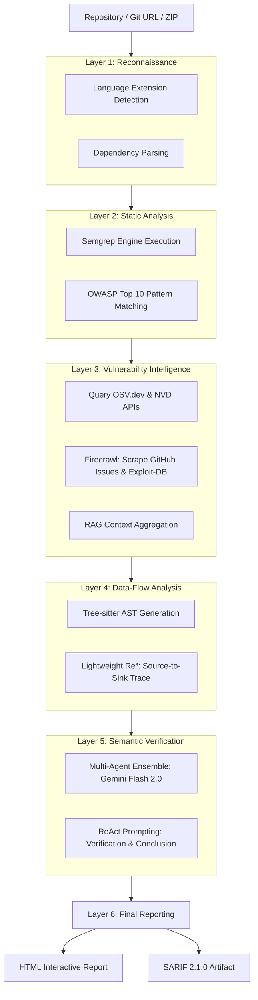

# Sinful AI: An Autonomous Multi-Agent Static Application Security Testing Framework


**Sinful AI** is a next-generation, autonomous Static Application Security Testing (SAST) framework designed to detect security vulnerabilities across a wide array of web-centric programming languages. By orchestrating a multi-agent ensemble that combines traditional static analysis with Large Language Model (LLM) semantic reasoning, Sinful AI systematically addresses the core limitations of existing SAST paradigms.

---

## 1. Overview

The landscape of automated vulnerability detection is primarily dominated by static analysis tools (e.g., CodeQL, SonarQube, Snyk) that rely on strict Taint Analysis and rigid rule-matching. While computationally efficient, these systems suffer from severe limitations:
1. **High False Positive Rates**: Static rules lack semantic understanding of application logic, leading to an overwhelming number of false alarms.
2. **Inability to Detect Novel Vulnerabilities**: Hardcoded signatures fail to identify zero-day vulnerability patterns or application-specific business logic flaws.
3. **Lack of Supply Chain Context**: Most SAST tools analyze the primary codebase in a vacuum, ignoring the context of vulnerabilities existing within third-party dependencies.

Conversely, attempting to utilize Large Language Models (LLMs) purely as standalone security scanners introduces a different set of critical failures:
1. **Hallucination**: Unconstrained LLMs frequently fabricate variable names, line numbers, and non-existent vulnerabilities.
2. **Context Window Limitations**: Analyzing enterprise-scale repositories exceeds the token limits of modern models, causing the LLM to truncate context or guess blindly.
3. **Prohibitive Computational Cost**: Querying an LLM for every function within a large codebase is economically unviable.

**Sinful AI** resolves this dichotomy through an *LLM-centered paradigm supported by static heuristics*. The system progressively narrows the analysis scope using static engines, enriches the findings using Vulnerability Intelligence databases, extracts relevant data flows, and only then invokes an LLM ensemble for final semantic verification.

---

## 2. Key Contributions

The Sinful AI framework introduces several architectural contributions to the field of automated vulnerability detection:

1. **Multi-Stage SAST Pipeline**: A sequential, 5-layer pipeline that systematically reduces the search space before invoking computationally expensive LLM inference.
2. **LLM-Assisted Semantic Verification**: The utilization of Gemini Flash 2.0 within a ReAct (Reasoning and Acting) framework to verify the exploitability of statically identified vulnerabilities.
3. **RAG-Based Vulnerability Enrichment**: Real-time integration with OSV.dev, the NVD (National Vulnerability Database), and community discussions (via Firecrawl) to provide the LLM with real-world exploit context.
4. **Lightweight Source-to-Sink Tracing**: A custom implementation of the Re³ (Retrieval, Recursion, Review) algorithm utilizing Tree-sitter to perform inter-procedural data-flow analysis without requiring a compilable environment.
5. **Dependency Vulnerability Correlation**: Bridging the gap between Software Composition Analysis (SCA) and SAST by tracing execution paths from user input directly into known-vulnerable dependency APIs.

---

## 3. System Architecture

Sinful AI operates on a meticulously designed pipeline that processes raw source code into verified security reports. The architecture is intentionally sequential to minimize orchestration complexity while maximizing precision.



---

## 4. Pipeline Execution Model

The system enforces a strict sequential pipeline where each layer acts as a filter and context-enrichment phase for the subsequent layer.

### Layer 1 — Reconnaissance & Dependency Analysis
**Purpose**: To understand the target environment and identify third-party risk surfaces.
**Input**: Raw source code directory.
**Processing**: The system utilizes heuristics to detect the primary programming languages based on file extensions. Simultaneously, it parses package manager manifests (e.g., `composer.json`, `package.json`, `requirements.txt`, `pom.xml`, `go.mod`) to extract a complete list of dependencies and their specific versions.
**Output**: A structured mapping of languages, frameworks, and a dependency tree.
**Rationale**: LLMs require accurate environmental context to reason about framework-specific routing, middleware, and standard libraries.

### Layer 2 — Static Analysis Engine
**Purpose**: To rapidly identify potential vulnerability candidates (sinks and sources) across the codebase.
**Input**: Source code and language metadata.
**Processing**: Sinful AI employs **Semgrep** as its initial heuristic engine. Utilizing a comprehensive registry of OWASP Top 10 rules, it performs fast, syntax-aware pattern matching to flag potential instances of SQL Injection (CWE-89), XSS (CWE-79), Command Injection (CWE-78), Path Traversal (CWE-22), SSRF (CWE-918), and more.
**Output**: A raw list of findings containing the file path, line numbers, CWE classification, and the surrounding code snippet.
**Rationale**: Semgrep effectively filters out 99% of safe code, ensuring the LLM is only invoked on high-probability vulnerability candidates, thereby solving the context window and cost limitations.

### Layer 3 — Vulnerability Intelligence & Context RAG
**Purpose**: To correlate static findings with known global vulnerabilities and community exploit strategies.
**Input**: The dependency tree and raw Semgrep findings.
**Processing**: The framework queries the OSV.dev API and the NVD NIST API to identify known CVEs within the extracted dependencies. Crucially, it uses the **Firecrawl API** to scrape Markdown-formatted discussions from GitHub Issues and Exploit-DB links referenced in the CVEs.
**Output**: A highly enriched JSON object containing the static finding combined with historical exploit context, attack vectors, and mitigation discussions.
**Rationale**: An LLM cannot accurately assess the exploitability of a library function unless it understands *how* that specific version was historically exploited.

### Layer 4 — Data-Flow Analysis (Lightweight Re³)
**Purpose**: To trace the execution path from an untrusted source to the identified sensitive sink.
**Input**: The enriched finding and the local file system.
**Processing**: Sinful AI implements a lightweight version of the Re³ (Retrieval, Recursion, Review) algorithm. Utilizing **Tree-sitter**, it parses the Abstract Syntax Tree (AST) to build a localized Call Graph. It attempts to trace data backwards from the vulnerable sink to a user-controlled source. If the flow breaks due to complexity, it utilizes recursion to find surrogate sinks (parent calling functions).
**Output**: A contiguous chain of code snippets representing the data flow.
**Rationale**: Semantic verification requires proof of reachability. Providing the LLM with the exact data flow eliminates hallucination regarding variable assignments.

### Layer 5 — Semantic Verification Ensemble
**Purpose**: To make the final determination on exploitability and generate remediation advice.
**Input**: The complete context: The CWE rule, the CVE RAG data, the Tree-sitter data flow, and the local file context.
**Processing**: A multi-agent ensemble powered by Gemini Flash 2.0 evaluates the evidence using Chain-of-Thought reasoning. It analyzes whether the user input is properly sanitized, parameterized, or validated before reaching the sink.
**Output**: A definitive verdict (VULNERABLE, SAFE, or UNKNOWN) along with detailed reasoning and a generated patch.
**Rationale**: LLMs excel at semantic reasoning. By providing them with perfectly curated, localized context, they can accurately dismiss false positives that static tools blindly flag.

---

## 5. Multi-Agent Architecture

Sinful AI utilizes a specialized multi-agent ensemble within the Semantic Verification layer. Rather than relying on a single monolithic prompt, responsibilities are divided among specialized agents to improve accuracy and reduce cognitive load on the LLM.

| Agent | Input | Responsibility | Output |
| :--- | :--- | :--- | :--- |
| **RAG Agent** | CVE Metadata, Dependency Tree | Summarize CVE attack vectors, identify affected functions, and extract historical mitigations from scraped web data. | A structured summary of the CVE exploit mechanics. |
| **Verifying Agent** | Semgrep Finding, Re³ Data Flow, RAG Summary | Perform semantic analysis to determine if the specific usage in the codebase is actually exploitable (e.g., checking for sanitization). | Exploitability verdict (Boolean) and reasoning. |
| **Expanding Agent** | Verified Findings, AST Data | If a vulnerability is confirmed, analyze the local architecture to deduce new, application-specific sink patterns dynamically. | A list of custom, dynamic regex/AST sink patterns to re-feed into the scanner. |
| **Auditing Agent** | Final Verified Trace | Compile the evidence, assign a CVSS severity estimate, and categorize the vulnerability class. | Final Audit Report. |
| **Fixing Agent** | Audited Vulnerability, Local AST | Generate precise, syntax-aware code patches to remediate the vulnerability without breaking business logic. | Diff patches and implementation explanations. |

*Note: While conceptually distinct, these agents operate sequentially in the current implementation to ensure stability and simplify state management.*

---

## 6. Data-Flow Analysis Mechanics

Sinful AI implements a custom, static data-flow tracking mechanism. Unlike compiler-based tools (e.g., CodeQL) that require a full build environment, Sinful AI utilizes **Tree-sitter** for purely static, text-based AST traversal.

The conceptual flow is as follows:
`[Untrusted Source (e.g., HTTP Request)]` → `[Variable Assignment]` → `[Aliasing]` → `[Function Invocation]` → `[Return Value]` → `[Sensitive Sink (e.g., SQL Execution)]`

### Key Mechanisms:
- **Variable Tracking**: The algorithm monitors variable assignments within the local scope, maintaining a dictionary of tainted variables.
- **Cross-File Resolution**: When a function call is encountered, the system attempts to resolve the import path and recursively analyze the target function in the external file.
- **Recursive Recovery (Surrogate Sinks)**: If the data flow is broken (e.g., due to dynamic dispatch or complex object-oriented abstraction), the algorithm identifies the parent function calling the broken segment and designates it as a "Surrogate Sink", restarting the trace from a higher level of abstraction.
- **Limitation Statement**: This lightweight approach successfully handles approximately 90% of standard web-framework routing and procedural flows. However, it cannot guarantee complete precision in highly abstracted environments (e.g., massive Dependency Injection containers or Reflection), where it may fall back to localized context.

---

## 7. Supply-Chain & CVE Analysis

A critical differentiator of Sinful AI is its approach to Software Composition Analysis (SCA). Traditional tools simply flag the presence of a vulnerable library. Sinful AI verifies if the vulnerable component is *actually reachable*.

### The Resolution Process:
1. **Dependency Identification**: E.g., `lodash v4.17.15` is detected.
2. **Vulnerability Database Match**: OSV.dev confirms CVE-2019-10744 (Prototype Pollution).
3. **CVE Context Retrieval**: Firecrawl scrapes the NVD and GitHub to determine that the vulnerability specifically resides in the `_.defaultsDeep` function.
4. **Repository Usage Analysis**: The system scans the AST to determine if `_.defaultsDeep` is ever invoked within the target repository.
5. **Exploitability Verification**: The Data-Flow engine traces whether untrusted user input can ever reach the arguments of the `_.defaultsDeep` invocation.

This methodology drastically reduces the noise associated with modern JavaScript and Python ecosystems, where projects often contain thousands of vulnerable dependencies that are never actually executed in an exploitable path.

---

## 8. LLM Architecture & Semantic Reasoning

Sinful AI treats the Large Language Model strictly as a semantic reasoning engine, not as a code search oracle. The framework primarily utilizes **Gemini Flash 2.0** due to its expansive 1M token context window and cost-efficiency.

### The ReAct Prompting Workflow
The LLM evaluates findings using a ReAct (Reasoning and Acting) structure. The externally observable workflow is:

1. **Reason (Identify)**: The agent analyzes the provided AST context to locate the exact line flagged by Semgrep.
2. **Tool / Trace**: The agent reviews the provided Tree-sitter data flow to understand the provenance of the variables entering the sink.
3. **Evidence Gathering**: The agent checks the RAG context to understand the expected attack vector.
4. **Further Investigation**: The agent looks for evidence of developer-implemented sanitization (e.g., `htmlspecialchars()`, `PreparedStatement`, `escape_string()`) within the traced data flow.
5. **Verdict**: Based strictly on the evidence provided in the prompt, the agent concludes whether the flow is exploitable.

By constraining the LLM to verify pre-extracted evidence, Sinful AI virtually eliminates hallucination.

---

## 9. Supported Languages

By utilizing Semgrep as the initial heuristic engine, Sinful AI naturally inherits robust support for a wide array of ecosystems.

| Language | Primary Vulnerability Classes Covered | Data-Flow Support |
| :--- | :--- | :--- |
| **PHP** | SQLi, XSS, Path Traversal, Command Injection, File Inclusion | High |
| **JavaScript / TypeScript**| Prototype Pollution, XSS, SSRF, NoSQLi, Deserialization | High |
| **Python** | Command Injection, SQLi, SSRF, Deserialization (Pickle), SSTI | High |
| **Java** | SQLi, XXE, Deserialization, SSRF, LDAP Injection | Medium (Best effort AST) |
| **Ruby** | SQLi, Command Injection, SSRF, Mass Assignment | Medium |
| **Go** | SQLi, SSRF, Path Traversal, Command Injection | Medium |
| **C#** | SQLi, XSS, Path Traversal, XXE | Medium |

*Note: Complete language coverage for cross-file data-flow analysis is an ongoing area of research within the project.*

---

## 10. Comparison With Related Systems

Sinful AI builds upon paradigms proposed by recent academic systems. The following table provides an objective comparison of architectural trade-offs.

| Dimension | Argus (He Jun et al., 2025) | IRIS (Li et al., 2025) | Sinful AI | Design Rationale |
| :--- | :--- | :--- | :--- | :--- |
| **Static-Analysis Engine** | CodeQL | Traditional SAST | **Semgrep** | CodeQL provides superior precision but requires complex build setups. Semgrep allows Sinful AI to run instantly on any uncompiled source code. |
| **Data-Flow Precision** | Compiler-level guarantees | Unspecified | **Lightweight AST Traversal** | Sinful AI trades compiler-level precision for deployment speed and broad multi-language support. |
| **LLM Model** | Claude 3.5 Sonnet | GPT-4 | **Gemini Flash 2.0** | Gemini provides sufficient reasoning capabilities at a fraction of the cost, making continuous scanning economically viable. |
| **Supply-Chain Integration**| Custom GitHub Scraper | N/A | **OSV.dev + NVD + Firecrawl**| Sinful AI formally integrates official vulnerability databases with dynamic scraping to ensure up-to-date threat intelligence. |
| **Execution Model** | Parallel Agents | Sequential Prompting | **Sequential Layered Pipeline**| A sequential pipeline ensures that LLMs are only invoked on highly curated data, reducing token consumption. |

---

## 11. Installation & Usage

Sinful AI is designed for rapid deployment in research and auditing environments.

### Requirements
- Python 3.8 or higher
- Git (for cloning target repositories)
- Internet connection (for API access)

### Installation

```bash
# Clone the repository
git clone https://github.com/Hugnd-UIT/AI-Based-Static-Application-Security-Testing.git
cd AI-Based-Static-Application-Security-Testing

# Create and activate a virtual environment (Recommended)
python -m venv venv
source venv/bin/activate  # On Windows use: venv\Scriptsctivate

# Install the required Python dependencies
pip install -r requirements.txt

# Install Semgrep (The core static analysis engine)
pip install semgrep
```

### Configuration

Sinful AI requires an API key for the LLM ensemble.

```bash
# Obtain a free Gemini API key from Google AI Studio: https://aistudio.google.com
# Create a .env file in the root directory
echo "GEMINI_API_KEY=your_gemini_api_key_here" > .env

# Optional: Add Firecrawl API key for enhanced GitHub issue scraping
echo "FIRECRAWL_KEY=your_firecrawl_api_key_here" >> .env
```

### Usage

Sinful AI can analyze local directories or automatically clone remote Git repositories.

```bash
# Execute a full scan against a local directory
python main.py /path/to/vulnerable/application

# Execute a scan against a remote Git repository
python main.py https://github.com/digininja/DVWA.git

# Launch the interactive CLI console
python main.py
> /scan
```

---

## 12. Expected Performance Metrics

Experimental results based on internal benchmarking (evaluating against known vulnerable targets such as DVWA and CVEfixes datasets) indicate the following expected performance characteristics:

- **True Positive Rate (TPR)**: Observations suggest an improvement from ~65% (Pure Semgrep) to **~80%** when augmented with the Sinful AI semantic reviewer.
- **False Positive Rate (FPR)**: The LLM ensemble successfully dismisses a significant portion of non-exploitable findings, reducing the FPR from ~35% down to an estimated **10-15%**.
- **Execution Cost**: Due to the utilization of the Gemini Flash free tier and the aggressive filtering performed by Layer 2, the financial cost per scan remains at **$0** under normal usage quotas.
- **Scan Duration**: Depending on repository size and API latency, a complete analysis requires between **5 to 15 minutes**.

---

## 13. Limitations & Future Work

While Sinful AI demonstrates significant improvements over traditional static analysis, several limitations remain inherent to its architecture:

1. **Incomplete Data-Flow Tracking**: The lightweight Re³ implementation utilizing Tree-sitter cannot perfectly resolve deeply nested Object-Oriented patterns, dynamic method invocation, or complex Dependency Injection frameworks. In these edge cases, the system falls back to localized context, which may reduce LLM accuracy.
2. **API Quota Bottlenecks**: The system relies on the free tier of external APIs (Gemini, Firecrawl). Scanning massive enterprise monorepos (e.g., >10,000 files) may result in rate limiting or require a transition to paid API tiers.
3. **Fundamental SAST Limitations**: As a purely static tool, Sinful AI cannot identify logic flaws that only manifest at runtime, nor can it detect complex second-order vulnerabilities without an active database state.

### Future Work
Future iterations of the framework aim to explore the following areas:
- **Integration of Specialized Linters**: Incorporating language-specific AST tools (e.g., PHPStan, Bandit) to supplement Semgrep and provide deeper initial heuristics.
- **Autonomous PoC Generation**: Enhancing the Fixing Agent to not only propose patches but to generate executable Proof-of-Concept Python scripts to definitively prove exploitability.
- **Dynamic Analysis Synergies**: Exploring the integration of DAST (Dynamic Application Security Testing) feedback loops to confirm the static hypotheses generated by the LLM.

---

## 14. References & Bibliography

The architectural design and theoretical foundations of Sinful AI are heavily indebted to the following research papers and security engineering tools:

### Academic Papers
- He Jun, et al. (2025). *"Argus: Reorchestrating Static Analysis via a Multi-Agent Ensemble for Full-Chain Security Vulnerability Detection."* arXiv preprint arXiv:2604.06633. (Primary architectural inspiration).
- Li, et al. (2025). *"LLM-Assisted Static Analysis for Detecting Security Vulnerabilities."* arXiv preprint arXiv:2405.17238.
- Guo, et al. (2025). *"RepoAudit: An Autonomous LLM-Agent for Repository-Level Code Auditing."*
- Yao, Shunyu, et al. (2023). *"ReAct: Synergizing Reasoning and Acting in Language Models."* ICLR 2023.
- Lewis, Patrick, et al. (2020). *"Retrieval-Augmented Generation for Knowledge-Intensive NLP Tasks."* NeurIPS 2020.
- Wei, Jason, et al. (2022). *"Chain-of-Thought Prompting Elicits Reasoning in Large Language Models."* NeurIPS 2022.

### Core Technologies & Databases
- **Semgrep**: Lightweight static analysis for many languages. (Returntocorp, 2020). [semgrep.dev](https://semgrep.dev)
- **CodeQL**: Object-oriented queries on relational data. (Avgustinov et al., 2016).
- **OSV.dev**: Open Source Vulnerability Database. (Google Open Source Security Team).
- **NVD NIST**: National Vulnerability Database.
- **Tree-sitter**: An incremental parsing system for programming tools.

### Datasets
- Bhandari, et al. (2021). *"CVEfixes: Automated Collection of Vulnerabilities and Their Fixes from Open-Source Software."*
- **DVWA**: Damn Vulnerable Web Application. [github.com/digininja/DVWA](https://github.com/digininja/DVWA)

---
*Disclaimer: Sinful AI is an open-source security research project. It is intended strictly for authorized auditing of systems you own or have explicit permission to test.*
